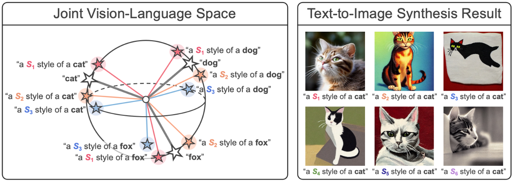

# PromptStyler: Prompt-driven Style Generation for Source-free Domain Generalization


**Given that the authors haven't released the source code, this repository represents our best effort to replicate PromptStyler based on the [original paper.](https://promptstyler.github.io/)**

## Datasets

- PACS: https://drive.google.com/uc?id=1m4X4fROCCXMO0lRLrr6Zz9Vb3974NWhE
- VLCS: http://www.mediafire.com/file/7yv132lgn1v267r/vlcs.tar.gz/file
- OfficeHome:  https://drive.google.com/file/d/0B81rNlvomiwed0V1YUxQdC1uOTg/view?resourcekey=0-2SNWq0CDAuWOBRRBL7ZZsw
- DomainNet:  http://ai.bu.edu/DomainNet/

**After downloading the data, unzip it into the 'datasets' folder.**

## Requirements

**How to Start:**
```shell
conda env create -f environment.yml
```

## Training & Inference 

Here, taking the training and inference of PACS as an example:
```shell
# Training
cd scripts
sh run_clip_pacs_ps.sh
```
Note: Before conducting inference testing, ensure that the loaded model weights are correct. 
Modify the '--model-dir' in the testing script to point to the model weights corresponding to the dataset.
```shell
# Inference
cd scripts
sh run_clip_pacs_ps_test.sh
```